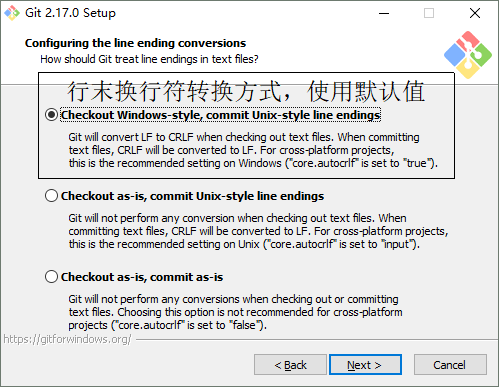
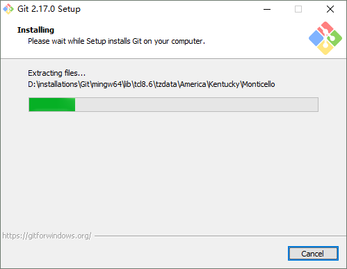
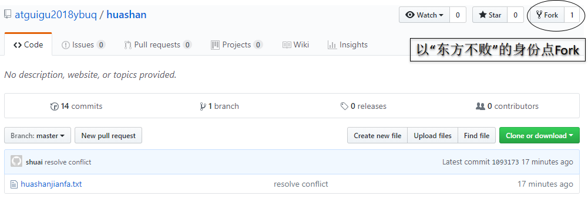

[TOC]

# 1.为什么需要版本控制？

从个人开发过渡到团队协作。


# 2.版本控制工具

- 集中式版本控制工具

  CVS、<font color='blue'>SVN(Subversion)</font>、VSS……

- 分布式版本控制工具

  <font color='blue'>Git</font>、Mercurial、Bazaar、Darcs……

# 3.Git简史


# 4.Git工作机制 


# 5.Git和代码托管中心

代码托管中心负责维护远程库。

- 局域网
  - GitLab
- 外网
  - GitHub
  - 码云

# 6.本地库和远程库交互机制

## ①团队内协作


## ②跨团队协作


# 7.Git安装








# 8.Git常用命令

| 命令名称                             | 作用           |
| ------------------------------------ | -------------- |
| git init                             | 初始化本地库   |
| git config --global user.name 用户名 | 设置用户签名   |
| git config --global user.email 邮箱  | 设置用户签名   |
| git status                           | 查看本地库状态 |
| git add 文件名                       | 添加到暂存区   |
| git commit -m "日志信息" 文件名      | 提交到本地库   |
| git reflog                           | 查看历史记录   |
| git reset --hard 版本号              | 版本穿梭       |

# 9.分支操作


## ①什么是分支      

在版本控制过程中，同时推进多个任务


## ②分支的好处

同时并行推进多个功能开发，提高开发效率
各个分支在开发过程中，如果某一个分支开发失败，不会对其他分支有任何影响。失败的分支删除重新开始即可。

## ③分支操作

| 命令名称            | 作用                         |
| ------------------- | ---------------------------- |
| git branch 分支名   | 创建分支                     |
| git branch -v       | 查看分支                     |
| git checkout 分支名 | 切换分支                     |
| git merge 分支名    | 把指定的分支合并到当前分支上 |

# 10.GitHub操作

| 名称       | 值                         |
| ---------- | -------------------------- |
| Email地址  | atguiguyueyue@aliyun.com   |
| GitHub账号 | atguiguyueyue              |
| Email地址  | atguiguhuhu@aliyun.com     |
| GitHub账号 | atguiguhuhu                |
| Email地址  | atguigudongdong@aliyun.com |
| GitHub账号 | atguigudongdong            |

# 11.创建远程库


# 12.远程库操作

## ①创建远程库地址别名

git remote -v 查看当前所有远程地址别名<br/>
git remote add 别名 远程地址

## ②推送

git push 别名 分支

## ③克隆

git clone 远程地址

(1.拉取代码

2.初始化本地库

3.创建别名)

## ④邀请加入团队


## ⑤拉取

git pull 远程库地址别名 远程分支名

# 13.跨团队协作

<br/>
<br/>
<br/>
<br/>
<br/>
<br/>
<br/>
<br/>
<br/>
<br/>
<br/>
<br/>
<br/>

# 14.SSH登录

进入当前用户的家目录<br/>
$ cd ~<br/>删除.ssh目录<br/>
$ rm -rvf .ssh<br/>
运行命令生成.ssh密钥目录<br/>
$ ssh-keygen -t rsa -C atguigu2018ybuq@aliyun.com<br/>
[注意：这里-C这个参数是大写的C]<br/>
进入.ssh目录查看文件列表<br/>
$ cd .ssh<br/>
$ ls -lF<br/>
查看id_rsa.pub文件内容<br/>
$ cat id_rsa.pub<br/>
复制id_rsa.pub文件内容，登录GitHub，点击用户头像→Settings→SSH and GPG keys<br/>
New SSH Key<br/>
输入复制的密钥信息<br/>
回到Git bash创建远程地址别名<br/>
git remote add origin_ssh git@github.com:atguigu2018ybuq/huashan.git<br/>
推送文件进行测试<br/>

# 15.配置Git忽略文件

## ①哪些文件要忽略？

### [1]Eclipse特定文件


### [2]IDEA特定文件


### [3]Maven工程的target目录


## ②为什么要忽略它们？

与项目的实际功能无关，不参与服务器上部署运行。把它们忽略掉能够屏蔽IDE工具之间的差异。

## ③怎么忽略？

### [1]创建忽略规则文件

这个文件的存放位置原则上在哪里都可以，为了便于让~/.gitconfig文件引用，建议也放在用户家目录下

```html
# Compiled class file
*.class

# Log file
*.log

# BlueJ files
*.ctxt

# Mobile Tools for Java (J2ME)
.mtj.tmp/

# Package Files #
*.jar
*.war
*.nar
*.ear
*.zip
*.tar.gz
*.rar

# virtual machine crash logs, see http://www.java.com/en/download/help/error_hotspot.xml
hs_err_pid*

.classpath
.project
.settings
target
.idea
*.iml
```

### [2]在.gitconfig文件中引用忽略规则文件

```html
[user]
	name = peter
	email = peter@atguigu.com
[core]
	excludesfile = C:/Users/ZhangJY/xxx.ignore
```

注意：这里要使用“正斜线（/）”，不要使用“反斜线（\）”

# 16.在IDEA中使用Git

## ①定位Git程序


## ②初始化本地库


## ③添加到暂存区


## ④提交到本地库


## ⑤创建分支


## ⑥切换分支

在IDEA窗口的右下角


## ⑦合并分支

在IDEA窗口的右下角


# 17.在IDEA中连接GitHub

## ①保存GitHub账号


## ②分享工程到GitHub


## ③clone


## ④push


## ⑤pull


